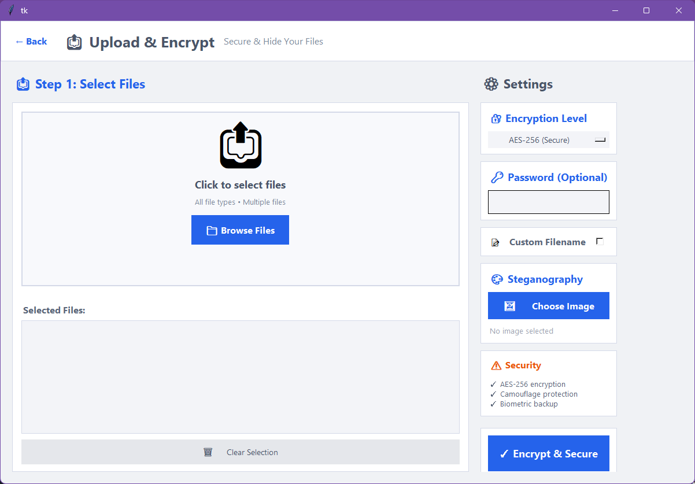
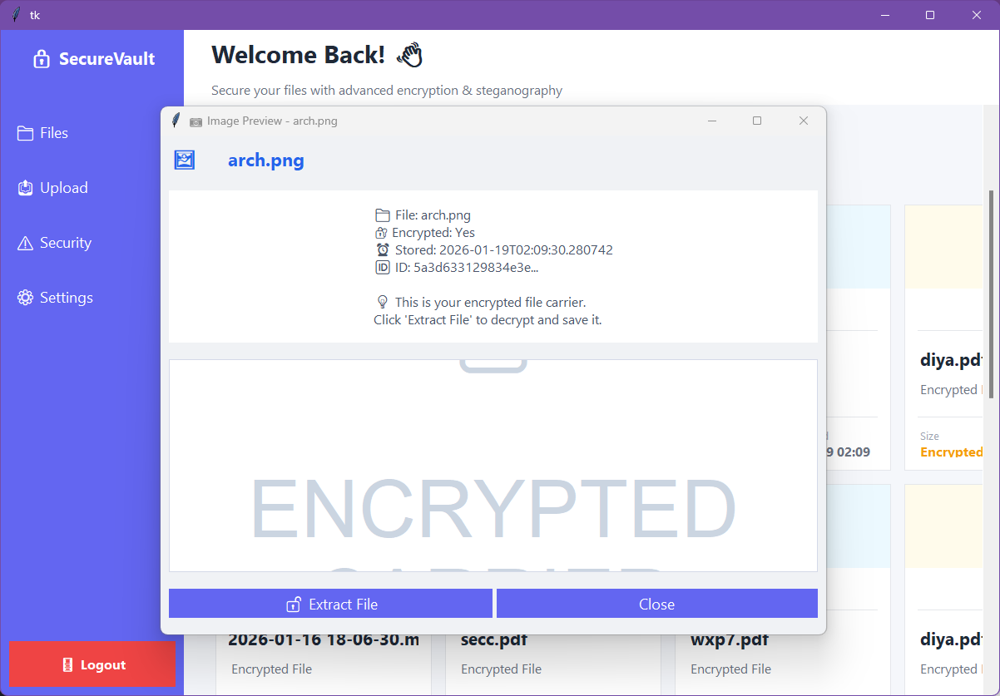
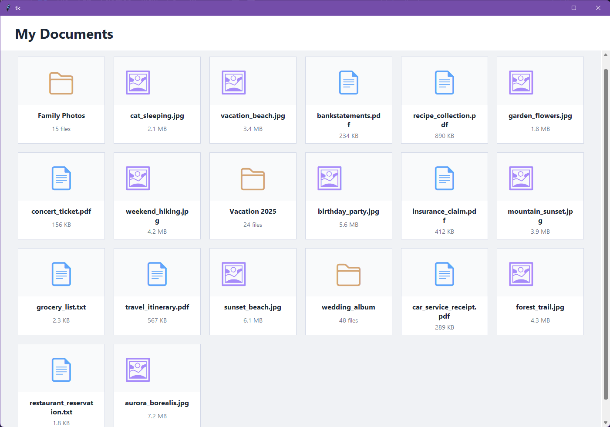

# 🔐 Secure File Vault

A Windows-based secure file vault that provides multi-layer protection for confidential files using **AES-256 encryption**, **image steganography**, **keystroke dynamics authentication**, **file camouflage**, **decoy protection**, **blockchain-backed integrity verification**, and **IPFS-based decentralized backup**.

---

## 📖 Overview

Secure File Vault is a desktop security application developed as a final-year B.Tech project. The system protects sensitive files through multiple security layers, ensuring confidentiality, integrity, and resilience against unauthorized access.

---

## ✨ Features

- 🔐 AES-256 File Encryption
- 🖼️ LSB Image Steganography
- ⌨️ Keystroke Dynamics Authentication
- 🎭 File Camouflage
- 🍯 Decoy (Honeytrap) Vault
- 📜 Secure File History
- ☁️ IPFS-Based Backup & Recovery
- ⛓️ Blockchain Integrity Verification
- 🖥️ Desktop GUI using Tkinter & PyQt

---

## 🏗️ System Architecture

```
User
   │
   ▼
Authentication
   │
   ▼
AES-256 Encryption
   │
   ▼
Steganography
   │
   ▼
File Camouflage
   │
   ├────────► Blockchain Ledger
   │
   └────────► IPFS Backup
```

---

## 🛠️ Technologies Used

- Python
- Tkinter
- PyQt
- Cryptography (Fernet / AES-256)
- Pillow (PIL)
- Scikit-learn
- NumPy
- IPFS
- SHA-256

---

## 📂 Project Structure

```
FinalBackup/
│
├── docs/
├── tests/
├── main.py
├── ipfs_blockchain_backup.py
├── requirements.txt
├── README.md
└── LICENSE
```

---

## 🚀 Installation

### Clone the repository

```bash
git clone https://github.com/fathimaali02/FinalBackup.git
```

### Navigate to the project

```bash
cd FinalBackup
```

### Install dependencies

```bash
pip install -r requirements.txt
```

### Run the application

```bash
python main.py
```

---

## ☁️ IPFS Setup

To enable decentralized backup and recovery:

1. Install IPFS Desktop or Kubo from the official IPFS website.
2. Start the local IPFS daemon.
3. Ensure the IPFS API is available on:

```
/ip4/127.0.0.1/tcp/5001/http
```

The application automatically connects to the local IPFS node when available.

---

## 🔒 Security Features

- AES-256 Encryption
- PBKDF2 Key Derivation
- SHA-256 Integrity Verification
- LSB Image Steganography
- Keystroke Dynamics Authentication
- File Camouflage
- Honeytrap Detection
- Blockchain Ledger
- IPFS Backup & Recovery

---
## 📷 Screenshots

### Login Page


### Encryption



### Decryption



### File History


### Decoy Vault



---

## 📚 Academic Project

**Project Title**

**A Steganography-Driven Secure File Vault with Keystroke Authentication and Decoy Protection Mechanism**

Developed as a Final Year B.Tech Project.

---

## 📄 License

This project is licensed under the MIT License.

## Contact
For any inquiries or support, contact:
- **Email**: sulphr21@gmail.com
- **Email**: adi.upendran888@gmail.com
- **Email**: diyaelavumkal4@gmail.com
- **Email**: fatimaali2424@gmail.com

---
